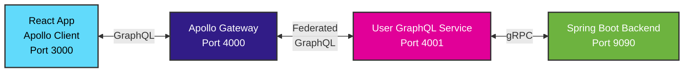

# Full-Stack GraphQL Federation with gRPC Backend

A modern **GraphQL Federation** architecture demonstrating microservices communication with a **gRPC backend**. Features Apollo Gateway, federated GraphQL services, and type-safe communication using Protocol Buffers.

**🆕 Production-ready with CI/CD pipeline and Docker deployment!**

## 🏗️ Architecture



- **Frontend**: React with Apollo Client (GraphQL)
- **API Gateway**: Apollo Federation Gateway (port 4000)
- **Microservice**: User GraphQL Service (port 4001) 
- **Backend**: Spring Boot gRPC Server (port 9090)
- **Protocol**: GraphQL over HTTP + gRPC with Protocol Buffers

## 📋 Prerequisites

- **Java 24+** (for Spring Boot backend)
- **Node.js 22+** (for GraphQL services and frontend)
- **Docker & Docker Compose** (for containerized deployment)
- **Maven 3.9+** (must be installed system-wide for backend build)

## 🚀 Quick Start

### Option 1: Docker Compose (Recommended)
```bash
git clone <repository>
cd stream-example

# Start entire stack with one command
docker-compose -f docker-compose.graphql.yml up --build

# Services will be available at:
# Frontend: http://localhost:3000
# Apollo Gateway: http://localhost:4000/graphql
# User Service: http://localhost:4001/graphql
# gRPC Backend: grpc://localhost:9090
```

### Option 2: Development Setup
```bash
# 1. Start gRPC Backend (Terminal 1)
cd backend
mvn spring-boot:run

# 2. Start User GraphQL Service (Terminal 2)
cd user-graphql-service
npm install && npm start

# 3. Start Apollo Gateway (Terminal 3)
cd apollo-gateway
npm install && npm start

# 4. Start Frontend (Terminal 4)
cd frontend-graphql
npm install && npm start
```

## 🧪 Testing the Application

### Quick Test
```graphql
# Get all users - Try this in GraphQL Playground at http://localhost:4000/graphql
query GetUsers {
  users {
    id
    name
    email
    role
    createdAt
  }
}

# Create a user
mutation CreateUser {
  createUser(name: "John Doe", email: "john@example.com", role: "USER") {
    id
    name
    email
  }
}
```

### Health Checks
```bash
curl http://localhost:4000/health  # Gateway health
curl http://localhost:4001/health  # User service health
curl http://localhost:3000         # Frontend
```

## 📚 Documentation

### Complete Guides
- **[🚀 Development Guide](./docs/DEVELOPMENT.md)** - Local setup, workflows, and best practices
- **[✨ Features Documentation](./docs/FEATURES.md)** - Detailed feature overview and capabilities
- **[📁 Project Structure](./docs/PROJECT_STRUCTURE.md)** - Complete project organization
- **[🏗️ Architecture Guide](./docs/INSTRUCTIONS.md)** - Detailed architecture explanation
- **[📈 GraphQL API Reference](./docs/GRAPHQL_API.md)** - Complete GraphQL API documentation

### CI/CD & Migration
- **[🔄 CI/CD Pipeline](./.github/workflows/README.md)** - GitHub Actions workflow documentation
- **[📋 Migration Guide](./docs/ADDING_APOLLO.md)** - How we evolved from gRPC-Web to GraphQL
- **[🗂️ Documentation Index](./docs/README.md)** - Complete documentation overview

## 🎯 Key Highlights

- **🔧 Backend**: Spring Boot 3.5 + gRPC with Java 24
- **🌐 API Gateway**: Apollo Federation for unified GraphQL API
- **🎨 Frontend**: React 18 + Apollo Client with Vite
- **🐋 DevOps**: Full Docker setup with multi-stage builds
- **🚦 CI/CD**: Comprehensive GitHub Actions pipeline
- **🔒 Security**: Trivy vulnerability scanning
- **📊 Monitoring**: Health checks and service discovery

## 🚧 Troubleshooting

| Issue | Quick Fix | Details |
|-------|-----------|---------|
| **503 Service Unavailable** | Check if backend is running on port 9090 | [Development Guide](./docs/DEVELOPMENT.md#troubleshooting) |
| **GraphQL Errors** | Verify service schemas and gateway config | [Architecture Guide](./docs/INSTRUCTIONS.md#troubleshooting) |
| **Docker Build Issues** | Clean Docker cache: `docker system prune` | [Development Guide](./docs/DEVELOPMENT.md#docker-issues) |

## 🔗 Quick Links

- **GraphQL Playground**: http://localhost:4000/graphql
- **Frontend**: http://localhost:3000
- **API Documentation**: [GraphQL API Reference](./docs/GRAPHQL_API.md)
- **CI/CD Pipeline**: [GitHub Actions Workflow](./.github/workflows/ci-cd.yml)

## 📈 Benefits of This Architecture

- **Type Safety**: End-to-end type safety from database to UI
- **Performance**: HTTP/2 multiplexing and binary gRPC protocol  
- **Developer Experience**: GraphQL introspection and strong IDE support
- **Scalability**: Microservices with federation for easy service addition
- **Modern Stack**: Latest versions of Spring Boot, React, and Apollo

## 📝 License

This project is for demonstration purposes and is provided as-is.
