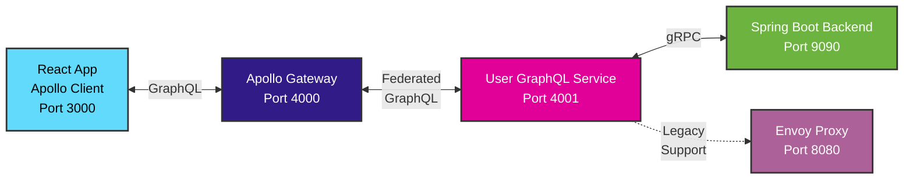

# Full-Stack GraphQL Federation with gRPC Backend

A modern **GraphQL Federation** architecture demonstrating microservices communication with a **gRPC backend**. Features Apollo Gateway, federated GraphQL services, and type-safe communication using Protocol Buffers.

**🆕 Production-ready with CI/CD pipeline and Docker deployment!**

## 🏗️ Architecture



- **Frontend**: React with Apollo Client (GraphQL)
- **API Gateway**: Apollo Federation Gateway (port 4000)
- **Microservice**: User GraphQL Service (port 4001) 
- **Backend**: Spring Boot gRPC Server (port 9090)
- **Proxy**: Envoy for legacy gRPC-Web support (port 8080)
- **Protocol**: GraphQL over HTTP + gRPC with Protocol Buffers

## 📋 Prerequisites

- **Java 24+** (for Spring Boot backend)
- **Node.js 18+** (for GraphQL services and frontend)
- **Docker & Docker Compose** (for containerized deployment)
- **Maven** (for backend build)

## 🚀 Quick Start

### Option 1: Docker Compose (Recommended)
```bash
git clone <repository>
cd stream-example

# Start entire stack with one command
docker-compose -f docker-compose.graphql.yml up --build

# Services will be available at:
# Frontend: http://localhost:3000
# Apollo Gateway: http://localhost:4000/graphql
# User Service: http://localhost:4001/graphql
# gRPC Backend: grpc://localhost:9090
```

### Option 2: Development Setup
```bash
# 1. Start gRPC Backend (Terminal 1)
cd backend
./mvnw spring-boot:run

# 2. Start User GraphQL Service (Terminal 2)
cd user-graphql-service
npm install && npm start

# 3. Start Apollo Gateway (Terminal 3)
cd apollo-gateway
npm install && npm start

# 4. Start Frontend (Terminal 4)
cd frontend-graphql
npm install && npm start
```

## 🧪 Testing the Application

### GraphQL Playground
- **Apollo Gateway**: http://localhost:4000/graphql
- **User Service**: http://localhost:4001/graphql

### Sample Queries
```graphql
# Get all users
query GetUsers {
  users {
    id
    name
    email
    role
    createdAt
  }
}

# Create a user
mutation CreateUser {
  createUser(name: "John Doe", email: "john@example.com", role: "USER") {
    id
    name
    email
  }
}
```

### Health Checks
```bash
curl http://localhost:4000/health  # Gateway health
curl http://localhost:4001/health  # User service health
curl http://localhost:3000         # Frontend
```
## 🚀 CI/CD Pipeline

This project includes a comprehensive **GitHub Actions workflow** for automated testing and deployment:

### Pipeline Stages
1. **Backend Testing** - Maven tests for Spring Boot gRPC service
2. **Node.js Services Testing** - Matrix testing for all GraphQL services and frontend
3. **Integration Testing** - Full Docker Compose stack testing with health checks
4. **Security Scanning** - Trivy vulnerability scanning
5. **Build & Push** - Docker image building (ready for registry)
6. **Deploy** - Staging deployment (configurable)

### Features
- ✅ **Automated testing** on every push and pull request
- ✅ **Docker multi-stage builds** for optimized images
- ✅ **Dependency caching** for faster builds
- ✅ **Health checks** for all services
- ✅ **Security scanning** with results in GitHub Security tab
- ✅ **Matrix strategy** for testing multiple services efficiently

See **[.github/workflows/README.md](.github/workflows/README.md)** for complete CI/CD documentation.

## 📚 Documentation

- **[CI/CD Pipeline](.github/workflows/README.md)** - GitHub Actions workflow documentation
- **[GraphQL API](./docs/GRAPHQL_API.md)** - Complete GraphQL API reference
- **[Architecture Guide](./docs/INSTRUCTIONS.md)** - Detailed architecture explanation
- **[Migration Guide](./docs/ADDING_APOLLO.md)** - How we evolved from gRPC-Web to GraphQL

## 📁 Project Structure

```
stream-example/
├── .github/workflows/         # CI/CD Pipeline
│   ├── ci-cd.yml             # Main workflow
│   └── README.md             # Pipeline documentation
├── backend/                  # Spring Boot gRPC Server (Java 24)
│   ├── src/main/
│   │   ├── java/            # gRPC service implementations
│   │   ├── proto/           # Protocol Buffer definitions
│   │   └── resources/       # Application configuration
│   ├── Dockerfile           # Multi-stage Docker build
│   └── pom.xml             # Maven dependencies
├── apollo-gateway/          # Apollo Federation Gateway (Node.js)
│   ├── src/index.js        # Gateway configuration
│   ├── Dockerfile          # Gateway container
│   └── package.json        # Gateway dependencies
├── user-graphql-service/    # GraphQL Microservice (Node.js)
│   ├── src/
│   │   ├── schema.js       # GraphQL schema
│   │   ├── resolvers.js    # GraphQL resolvers
│   │   └── grpc-client.js  # gRPC client integration
│   ├── Dockerfile          # Service container
│   └── package.json        # Service dependencies
├── frontend-graphql/        # React Frontend (JavaScript + Vite)
│   ├── src/
│   │   ├── App.jsx         # Main React component
│   │   └── index.jsx       # Apollo Client setup
│   ├── Dockerfile          # Frontend container
│   └── package.json        # Frontend dependencies
├── docs/                   # Documentation
│   ├── GRAPHQL_API.md      # GraphQL API reference
│   ├── INSTRUCTIONS.md     # Architecture guide
│   └── ADDING_APOLLO.md    # Migration documentation
├── docker-compose.graphql.yml # GraphQL federation stack
├── envoy.yaml              # Envoy proxy configuration (legacy)
└── README.md               # This file
```

## ✨ Key Features

### 🔧 Backend (Spring Boot + gRPC)
- **Pure gRPC server** (no REST/web endpoints)
- **Spring Boot 3.5** with Spring gRPC integration
- **Java 24** with modern language features
- **Type-safe Protocol Buffers** for service definitions
- **Multi-stage Docker builds** for optimized containers
- **Health checks** and service reflection enabled

### 🌐 GraphQL Federation (Apollo)
- **Apollo Federation Gateway** for unified API
- **Federated microservices** architecture
- **GraphQL to gRPC translation** layer
- **Type-safe schema composition**
- **Health monitoring** for all services

### 🎨 Frontend (React + Apollo Client)
- **Modern React 18** with JavaScript (Vite)
- **Apollo Client** for GraphQL state management
- **Real-time queries and mutations**
- **Responsive Material-inspired UI**
- **Optimized Vite builds**

### � DevOps & CI/CD
- **GitHub Actions pipeline** with comprehensive testing
- **Docker Compose** for local development
- **Multi-stage builds** for production optimization
- **Security scanning** with Trivy
- **Health checks** and integration testing

## 🛠️ Development

### Local Development Workflow
```bash
# Start backend only
cd backend && ./mvnw spring-boot:run

# Start GraphQL services
cd user-graphql-service && npm run dev
cd apollo-gateway && npm run dev

# Start frontend with hot reload
cd frontend-graphql && npm start
```

### Code Generation
Protocol Buffer changes automatically trigger:
- **Java code generation** (Maven compile)
- **gRPC service stubs** (Spring gRPC)

### Testing
```bash
# Backend tests
cd backend && ./mvnw test

# Integration tests with Docker
docker-compose -f docker-compose.graphql.yml up --build

# Manual GraphQL testing
curl -X POST http://localhost:4000/graphql \
  -H "Content-Type: application/json" \
  -d '{"query":"{ users { id name email } }"}'
```

## 🐋 Docker Deployment

### Production Build
```bash
# Build all services
docker-compose -f docker-compose.graphql.yml build

# Start in production mode
docker-compose -f docker-compose.graphql.yml up -d

# Check service health
curl http://localhost:4000/health
curl http://localhost:4001/health
curl http://localhost:3000
```

### Multi-Stage Builds
All services use optimized multi-stage Docker builds:
- **Backend**: Java build stage + runtime stage
- **Node.js Services**: Dependency caching + production builds
- **Frontend**: Vite build + Nginx serving

## 🧪 API Examples

### GraphQL Queries
```graphql
# Fetch all users
query GetAllUsers {
  users {
    id
    name
    email
    role
    createdAt
  }
}

# Create new user
mutation CreateUser {
  createUser(
    name: "Jane Smith"
    email: "jane@example.com"
    role: "ADMIN"
  ) {
    id
    name
    email
    role
  }
}

# Update existing user
mutation UpdateUser {
  updateUser(
    id: "1"
    name: "Updated Name"
    email: "updated@example.com"
  ) {
    id
    name
    email
  }
}
```

### gRPC Testing (Advanced)
```bash
# Using grpcurl for direct gRPC testing
grpcurl -plaintext localhost:9090 list
grpcurl -plaintext localhost:9090 org.jrg.grpc.UserService/GetAllUsers

# Test gRPC with JSON
grpcurl -plaintext -d '{}' localhost:9090 org.jrg.grpc.UserService/GetAllUsers
```

## Docker Alternative

1. Start all services:
   ```bash
   docker-compose up --build
   ```

This will start:
- gRPC backend on port 9090
- Envoy proxy on port 8080 (gRPC-Web endpoint)
- React frontend on port 3000

### Option 2: Manual Setup

#### Backend Setup

1. Navigate to the backend directory:
   ```bash
   cd backend
   ```

Use Docker Compose for simplified multi-service setup:

```bash
# Build and start all services
docker-compose up --build

# Stop all services
docker-compose down
```

Services will be available at:
- Frontend: http://localhost:3000
- Envoy Proxy: http://localhost:8080
- Backend: gRPC on port 9090

## 🧪 Testing the Application

### Manual Testing
1. Open http://localhost:3000
2. Click "Load Users" to fetch users via gRPC
3. Use the form to create/edit users
4. Test all CRUD operations

### gRPC Testing (Optional)
```bash
# Using grpcurl (if installed)
grpcurl -plaintext localhost:9090 list
grpcurl -plaintext localhost:9090 org.jrg.grpc.UserService/GetAllUsers
```

### Debugging
- **Envoy Admin Interface**: http://localhost:9901
- **Backend Logs**: Check console output
- **Frontend Console**: Browser developer tools

## 🚧 Troubleshooting

| Issue | Solution |
|-------|----------|
| **503 Service Unavailable** | Check if backend is running on port 9090 |
| **CORS Errors** | Verify Envoy CORS configuration |
| **Connection Refused** | Ensure Envoy can reach backend (check IP in envoy.yaml) |
| **Method Not Found** | Regenerate proto clients after changes |

For detailed troubleshooting, see [INSTRUCTIONS.md](./INSTRUCTIONS.md).

## 🔧 gRPC Service Definition

### gRPC Service (via gRPC-Web on port 8080)
The `user_service.proto` file defines:

```protobuf
service UserService {
  rpc GetUser(GetUserRequest) returns (User);
  rpc GetAllUsers(GetAllUsersRequest) returns (GetAllUsersResponse);
  rpc CreateUser(CreateUserRequest) returns (User);
  rpc UpdateUser(UpdateUserRequest) returns (User);
  rpc DeleteUser(DeleteUserRequest) returns (DeleteUserResponse);
  rpc StreamUsers(StreamUsersRequest) returns (stream User);
}

message User {
  int64 id = 1;
  string name = 2;
  string email = 3;
  string role = 4;
  string created_at = 5;
}
```

All gRPC calls are routed through Envoy proxy at http://localhost:8080

## 🎯 Usage Examples

### Frontend (React/TypeScript)
```typescript
// Auto-generated client from .proto
const client = new UserServiceClient('http://localhost:8080');

// Type-safe gRPC call
const request = new GetAllUsersRequest();
const response = await client.getAllUsers(request, {});
const users = response.getUsersList();
```

### Backend (Spring Boot/Java)
```java
@GrpcService
public class UserGrpcService extends UserServiceGrpc.UserServiceImplBase {
    @Override
    public void getAllUsers(GetAllUsersRequest request, 
                           StreamObserver<GetAllUsersResponse> responseObserver) {
        // Implementation
    }
}
```

## 📈 Benefits of This Architecture

- **Type Safety**: End-to-end type safety from database to UI
- **Performance**: HTTP/2 multiplexing and binary protocol  
- **Code Generation**: Automatic client/server stub generation
- **Future-Proof**: Easy to add streaming, new services, other languages
- **Developer Experience**: Strong IDE support and tooling

## 🔗 Additional Resources

- **[Protocol Buffers Guide](https://protobuf.dev/)**
- **[gRPC Documentation](https://grpc.io/docs/)**
- **[Spring gRPC](https://github.com/grpc-ecosystem/grpc-spring)**
- **[Envoy Proxy](https://www.envoyproxy.io/docs/)**

## 📝 License

This project is for demonstration purposes.

### Frontend gRPC Client Generation
The frontend uses `protoc` with `protoc-gen-grpc-web` to generate TypeScript client code from `.proto` files. Generated files are placed in `src/generated/`.


## Future Enhancements

1. **Server Streaming**: Implement real-time user updates via gRPC streaming
2. **Authentication**: Add JWT or OAuth2 authentication with gRPC interceptors
3. **Database**: Replace in-memory storage with JPA/Hibernate
4. **Validation**: Add input validation and error handling
5. **Testing**: Add unit and integration tests for gRPC services
6. **TLS**: Enable TLS for production gRPC communication
7. **Load Balancing**: Add multiple backend instances with Envoy load balancing

## License

This project is for demonstration purposes and is provided as-is.
