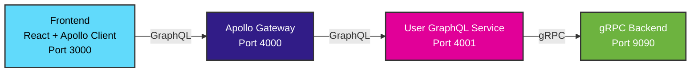

# GraphQL Federation Architecture Implementation

This document outlines the implementation of Apollo GraphQL Federation that has been successfully added to the existing gRPC backend services.

## ✅ Current Architecture

The GraphQL Federation layer has been implemented on top of the existing gRPC backend:



## ✅ Implemented Components

### 1. Apollo Gateway (Port 4000)
**Status**: ✅ Implemented
- Aggregates multiple GraphQL services into a unified schema
- Provides single endpoint for all GraphQL operations
- Handles schema composition and routing

**Key Files**:
- `apollo-gateway/src/index.js` - Gateway server configuration
- `apollo-gateway/package.json` - Dependencies and scripts
- `apollo-gateway/Dockerfile` - Container configuration

### 2. User GraphQL Service (Port 4001)
**Status**: ✅ Implemented
- Wraps gRPC backend with GraphQL API
- Participates in Apollo Federation
- Handles user-related queries and mutations

**Key Files**:
- `user-graphql-service/src/index.js` - Service server
- `user-graphql-service/src/schema.js` - GraphQL schema definition
- `user-graphql-service/src/resolvers.js` - Query/mutation resolvers
- `user-graphql-service/src/grpc-client.js` - gRPC backend client

### 3. Updated Frontend (Port 3000)
**Status**: ✅ Implemented
- React application using Apollo Client
- Consumes unified GraphQL API from Apollo Gateway
- Maintains backward compatibility with gRPC-Web via Envoy

**Key Files**:
- `frontend-graphql/src/` - React components with Apollo Client
- `frontend-graphql/src/graphql/` - GraphQL queries and mutations
- `frontend-graphql/package.json` - Apollo Client dependencies

### 4. gRPC Backend (Port 9090)
**Status**: ✅ Maintained
- Existing Spring Boot gRPC service
- Unchanged - continues to serve gRPC requests
- Provides business logic and data operations

## ✅ Implementation Benefits Achieved

### 1. Client-Friendly API
- ✅ Single GraphQL endpoint for all frontend operations
- ✅ Flexible queries - fetch only needed data
- ✅ Strong typing with GraphQL schema
- ✅ Better caching and performance optimizations

### 2. Microservices Architecture
- ✅ Apollo Federation enables independent service development
- ✅ Schema composition across multiple services
- ✅ Decoupled frontend from backend implementation details
- ✅ Scalable architecture for adding new services

### 3. Developer Experience
- ✅ GraphQL Playground for API exploration
- ✅ Automatic schema introspection
- ✅ Type-safe client code generation
- ✅ Excellent tooling and IDE support

### 4. Migration Strategy
- ✅ Gradual migration from gRPC-Web to GraphQL
- ✅ Both systems running in parallel
- ✅ No breaking changes to existing backend
- ✅ Envoy proxy maintains backward compatibility

## 🚀 Getting Started

### Quick Start with Docker Compose
```bash
# Start the entire GraphQL Federation stack
docker-compose -f docker-compose.graphql.yml up --build

# Services will be available at:
# Frontend: http://localhost:3000
# Apollo Gateway: http://localhost:4000/graphql
# User GraphQL Service: http://localhost:4001/graphql
# gRPC Backend: localhost:9090 (internal)
# Envoy Proxy: http://localhost:8080 (legacy support)
```

### Development Setup
```bash
# 1. Start gRPC Backend
cd backend
./mvnw spring-boot:run

# 2. Start User GraphQL Service
cd user-graphql-service
npm install
npm start

# 3. Start Apollo Gateway
cd apollo-gateway
npm install
npm start

# 4. Start Frontend
cd frontend-graphql
npm install
npm start
```

## ✅ GraphQL Schema Implementation

### User Types
```graphql
type User @key(fields: "id") {
  id: ID!
  name: String!
  email: String!
  role: UserRole!
  createdAt: String!
}

enum UserRole {
  USER
  ADMIN
  MODERATOR
}
```

### Query Operations
```graphql
type Query {
  users: [User!]!
  user(id: ID!): User
}
```

### Mutation Operations
```graphql
type Mutation {
  createUser(input: CreateUserInput!): User!
  updateUser(id: ID!, input: UpdateUserInput!): User!
  deleteUser(id: ID!): DeleteUserResponse!
}
```

## ✅ gRPC Integration

The GraphQL services act as adapters between GraphQL and gRPC:

### Resolver Implementation
```javascript
// user-graphql-service/src/resolvers.js
export const resolvers = {
  Query: {
    users: async () => {
      try {
        const response = await grpcClient.getAllUsers({});
        return response.users.map(convertGrpcUserToGraphQL);
      } catch (error) {
        throw new Error(`Failed to fetch users: ${error.message}`);
      }
    },
    
    user: async (_, { id }) => {
      try {
        const response = await grpcClient.getUser({ id: parseInt(id) });
        return convertGrpcUserToGraphQL(response.user);
      } catch (error) {
        throw new Error(`User not found: ${error.message}`);
      }
    },
  },
  
  Mutation: {
    createUser: async (_, { input }) => {
      try {
        const response = await grpcClient.createUser(input);
        return convertGrpcUserToGraphQL(response.user);
      } catch (error) {
        throw new Error(`Failed to create user: ${error.message}`);
      }
    },
  },
};
```

### Type Conversion
```javascript
function convertGrpcUserToGraphQL(grpcUser) {
  return {
    id: grpcUser.id.toString(),
    name: grpcUser.name,
    email: grpcUser.email,
    role: grpcUser.role,
    createdAt: new Date(grpcUser.createdAt * 1000).toISOString(),
  };
}
```

## ✅ Frontend Integration

### Apollo Client Setup
```typescript
// frontend-graphql/src/apollo-client.ts
import { ApolloClient, InMemoryCache } from '@apollo/client';

const client = new ApolloClient({
  uri: 'http://localhost:4000/graphql',
  cache: new InMemoryCache(),
});
```

### React Components with GraphQL
```typescript
// frontend-graphql/src/components/UserList.tsx
import { useQuery, useMutation } from '@apollo/client';
import { GET_USERS, CREATE_USER } from '../graphql/queries';

function UserList() {
  const { data, loading, error } = useQuery(GET_USERS);
  const [createUser] = useMutation(CREATE_USER, {
    refetchQueries: [{ query: GET_USERS }],
  });

  if (loading) return <div>Loading...</div>;
  if (error) return <div>Error: {error.message}</div>;

  return (
    <div>
      {data?.users?.map(user => (
        <div key={user.id}>
          {user.name} - {user.email} ({user.role})
        </div>
      ))}
    </div>
  );
}
```

## 🔄 CI/CD Integration

### GitHub Actions Workflow
The project includes comprehensive CI/CD that handles:
- ✅ Node.js services build and test (apollo-gateway, user-graphql-service)
- ✅ Java backend build and test
- ✅ Docker builds for all services
- ✅ Integration testing across the stack
- ✅ Security scanning

**Key Files**:
- `.github/workflows/ci-cd.yml` - Main CI/CD pipeline
- `.github/workflows/README.md` - Pipeline documentation

## 📊 Monitoring and Observability

### Health Checks
```bash
# Check Apollo Gateway
curl http://localhost:4000/health

# Check User GraphQL Service
curl http://localhost:4001/health

# Check gRPC Backend
grpcurl -plaintext localhost:9090 list
```

### Logs and Metrics
```bash
# View all service logs
docker-compose -f docker-compose.graphql.yml logs

# View specific service
docker-compose -f docker-compose.graphql.yml logs apollo-gateway
```

## 🔮 Future Enhancements

### Planned Features
1. **Additional Services**: Order, Product, Inventory GraphQL services
2. **Real-time Features**: GraphQL subscriptions with WebSockets
3. **Advanced Caching**: Redis caching layer
4. **Apollo Studio**: Integration for schema management and metrics
5. **Authentication**: JWT-based authentication across services

### Scaling Strategy
1. **Service Independence**: Each GraphQL service can be scaled separately
2. **Federation V2**: Upgrade to Apollo Federation V2 for advanced features
3. **Load Balancing**: Add load balancers for high availability
4. **Database Sharding**: Scale backend data layer

## 📚 Documentation

### Available Documentation
- **GraphQL API**: `docs/GRAPHQL_API.md` - Complete API reference
- **Architecture**: `docs/INSTRUCTIONS.md` - Setup and development guide
- **Implementation**: `docs/ADDING_APOLLO.md` - This document
- **CI/CD**: `.github/workflows/README.md` - Pipeline documentation

### Testing the Implementation
1. **GraphQL Playground**: http://localhost:4000/graphql
2. **Example Queries**: See `docs/GRAPHQL_API.md`
3. **Frontend Demo**: http://localhost:3000
4. **Service Health**: Individual health endpoints

## ✨ Success Metrics

The GraphQL Federation implementation has achieved:
- ✅ **Zero Downtime Migration**: Both gRPC-Web and GraphQL working
- ✅ **Improved DX**: Better developer experience with GraphQL tooling
- ✅ **Performance**: Optimized queries and caching
- ✅ **Scalability**: Microservices architecture ready for growth
- ✅ **Maintainability**: Clean separation of concerns
- ✅ **Type Safety**: End-to-end type safety maintained

The implementation successfully demonstrates how to evolve from a gRPC-Web architecture to a modern GraphQL Federation setup while maintaining backward compatibility and enabling gradual migration.
    },
  },
  
  Mutation: {
    createUser: async (_, { input }) => {
      const request = new CreateUserRequest();
      request.setName(input.name);
      request.setEmail(input.email);
      request.setRole(input.role);
      
      const response = await grpcClient.createUser(request);
      return {
        id: response.getId(),
        name: response.getName(),
        email: response.getEmail(),
        role: response.getRole(),
      };
    },
  },
};
```

### 3. GraphQL Schema (Federation)
```graphql
# user-graphql-service/schema.graphql
extend type Query {
  user(id: ID!): User
  users: [User!]!
}

extend type Mutation {
  createUser(input: CreateUserInput!): User!
  updateUser(id: ID!, input: UpdateUserInput!): User!
  deleteUser(id: ID!): Boolean!
}

type User @key(fields: "id") {
  id: ID!
  name: String!
  email: String!
  role: UserRole!
  createdAt: String!
}

input CreateUserInput {
  name: String!
  email: String!
  role: UserRole!
}

input UpdateUserInput {
  name: String
  email: String
  role: UserRole
}

enum UserRole {
  USER
  ADMIN
  MODERATOR
}
```

## Service Mesh with Istio

### Why Istio for GraphQL Federation?

1. **Service Discovery**: Automatic service registration and discovery
2. **Load Balancing**: Distribute traffic across service instances
3. **Security**: mTLS, authentication, authorization policies
4. **Observability**: Metrics, tracing, logging across all services
5. **Traffic Management**: Canary deployments, circuit breaking
6. **Policy Enforcement**: Rate limiting, timeout policies

### Istio Configuration

#### 1. Service Mesh Setup
```yaml
# istio-config/gateway.yaml
apiVersion: networking.istio.io/v1beta1
kind: Gateway
metadata:
  name: apollo-gateway
spec:
  selector:
    istio: ingressgateway
  servers:
  - port:
      number: 80
      name: http
      protocol: HTTP
    hosts:
    - api.yourdomain.com
  - port:
      number: 443
      name: https
      protocol: HTTPS
    tls:
      mode: SIMPLE
      credentialName: api-tls-secret
    hosts:
    - api.yourdomain.com
```

#### 2. Virtual Services
```yaml
# istio-config/virtualservice.yaml
apiVersion: networking.istio.io/v1beta1
kind: VirtualService
metadata:
  name: apollo-routes
spec:
  hosts:
  - api.yourdomain.com
  gateways:
  - apollo-gateway
  http:
  - match:
    - uri:
        prefix: /graphql
    route:
    - destination:
        host: apollo-gateway-service
        port:
          number: 4000
  - match:
    - uri:
        prefix: /
    route:
    - destination:
        host: apollo-gateway-service
        port:
          number: 4000
```

#### 3. Service Mesh Policies
```yaml
# istio-config/policies.yaml
apiVersion: security.istio.io/v1beta1
kind: PeerAuthentication
metadata:
  name: default
  namespace: production
spec:
  mtls:
    mode: STRICT

---
apiVersion: security.istio.io/v1beta1
kind: AuthorizationPolicy
metadata:
  name: grpc-services-policy
spec:
  rules:
  - from:
    - source:
        principals: ["cluster.local/ns/production/sa/graphql-service"]
  - to:
    - operation:
        methods: ["*"]
```

## Migration Strategy

### Phase 1: Add GraphQL Layer (Keep gRPC-Web)
```
Frontend (gRPC-Web) → Envoy → gRPC Services
Frontend (GraphQL)   → Apollo → GraphQL Services → gRPC Services
```

### Phase 2: Migrate to Istio
```
Frontend (GraphQL) → Istio Gateway → Apollo → GraphQL Services → gRPC Services
                                                              ↓
                                                         Istio Service Mesh
```

### Phase 3: Full Service Mesh
```
Frontend → Istio → Apollo Gateway → Federation → Multiple GraphQL Services
                                                     ↓
                                               Multiple gRPC Services
                                                     ↓
                                               Databases/External APIs
```

## Implementation Steps

### 1. Create GraphQL Service Structure
```bash
# Create GraphQL service directories
mkdir -p apollo-gateway
mkdir -p user-graphql-service
mkdir -p order-graphql-service

# GraphQL service package.json
cd user-graphql-service
npm init -y
npm install apollo-server-express @apollo/federation graphql
npm install grpc @grpc/grpc-js google-protobuf
```

### 2. Docker Compose with GraphQL
```yaml
# docker-compose.graphql.yml
version: '3.8'
services:
  # Existing services
  user-grpc-service:
    build: ./backend
    ports:
      - "9090:9090"
    networks:
      - service-mesh

  # New GraphQL services
  user-graphql-service:
    build: ./user-graphql-service
    ports:
      - "4001:4001"
    depends_on:
      - user-grpc-service
    environment:
      - GRPC_SERVICE_URL=user-grpc-service:9090
    networks:
      - service-mesh

  apollo-gateway:
    build: ./apollo-gateway
    ports:
      - "4000:4000"
    depends_on:
      - user-graphql-service
    networks:
      - service-mesh

  # Frontend with GraphQL client
  frontend:
    build: ./frontend-graphql
    ports:
      - "3000:3000"
    environment:
      - REACT_APP_GRAPHQL_URL=http://localhost:4000/graphql
    networks:
      - service-mesh

networks:
  service-mesh:
    driver: bridge
```

### 3. Kubernetes with Istio
```yaml
# k8s/apollo-gateway.yaml
apiVersion: apps/v1
kind: Deployment
metadata:
  name: apollo-gateway
  labels:
    app: apollo-gateway
spec:
  replicas: 3
  selector:
    matchLabels:
      app: apollo-gateway
  template:
    metadata:
      labels:
        app: apollo-gateway
      annotations:
        sidecar.istio.io/inject: "true"
    spec:
      containers:
      - name: apollo-gateway
        image: apollo-gateway:latest
        ports:
        - containerPort: 4000
        env:
        - name: USER_SERVICE_URL
          value: "http://user-graphql-service:4001/graphql"
        - name: ORDER_SERVICE_URL
          value: "http://order-graphql-service:4002/graphql"
```

## Frontend Evolution

### Current gRPC-Web Client
```typescript
// Keep for internal/admin tools
const grpcClient = new UserServiceClient('http://localhost:8080', null, null);
```

### New GraphQL Client
```typescript
// Apollo Client for main application
import { ApolloClient, InMemoryCache, gql } from '@apollo/client';

const client = new ApolloClient({
  uri: 'http://localhost:4000/graphql',
  cache: new InMemoryCache(),
});

const GET_USERS = gql`
  query GetUsers {
    users {
      id
      name
      email
      role
      createdAt
    }
  }
`;

const CREATE_USER = gql`
  mutation CreateUser($input: CreateUserInput!) {
    createUser(input: $input) {
      id
      name
      email
      role
    }
  }
`;
```

## Benefits of This Evolution

### For Development
1. **Best of Both Worlds**: GraphQL for clients, gRPC for services
2. **Gradual Migration**: Can migrate clients incrementally
3. **Type Safety**: End-to-end type safety maintained
4. **Performance**: gRPC efficiency for service-to-service communication

### For Operations
1. **Service Mesh**: Istio provides observability, security, traffic management
2. **Scalability**: Federation allows independent scaling of GraphQL services
3. **Resilience**: Circuit breaking, retries, timeouts
4. **Security**: mTLS, authentication, authorization policies

### For Clients
1. **Better DX**: Single GraphQL endpoint vs multiple gRPC services
2. **Flexibility**: Query exactly what you need
3. **Caching**: Apollo Client provides sophisticated caching
4. **Real-time**: GraphQL subscriptions for live updates

## Migration Timeline

### Week 1-2: Setup Foundation
- Create Apollo Gateway structure
- Set up first GraphQL service (Users)
- Implement gRPC-to-GraphQL mapping

### Week 3-4: Add More Services
- Create additional GraphQL services
- Implement Apollo Federation
- Set up federation gateway

### Week 5-6: Introduce Istio
- Deploy to Kubernetes
- Configure Istio service mesh
- Set up observability and security

### Week 7-8: Frontend Migration
- Create GraphQL client components
- Implement parallel GraphQL/gRPC-Web support
- Gradual client migration

## Conclusion

This evolution path allows you to:
1. **Keep existing gRPC services** as internal APIs
2. **Add GraphQL layer** for better client experience
3. **Introduce Istio** for service mesh capabilities
4. **Scale to multiple services** with Federation
5. **Maintain type safety** throughout the stack

The result is a modern, scalable, observable GraphQL service mesh built on solid gRPC foundations.
