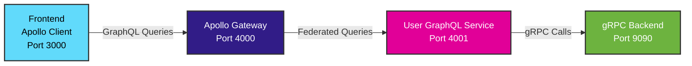

# GraphQL API Documentation

This document describes the GraphQL Federation API that wraps the existing gRPC backend services using Apollo Federation.

## Architecture Overview



## API Endpoints

- **Apollo Gateway**: http://localhost:4000/graphql (unified GraphQL endpoint)
- **User GraphQL Service**: http://localhost:4001/graphql (federated subgraph)
- **GraphQL Playground**: http://localhost:4000/graphql (in development mode)
- **gRPC Backend**: localhost:9090 (internal service communication)

## GraphQL Schema

### User Type
```graphql
type User {
  id: ID!
  name: String!
  email: String!
  role: UserRole!
  createdAt: String!
}
```

### User Role Enum
```graphql
enum UserRole {
  USER
  ADMIN
  MODERATOR
}
```

### Query Operations
```graphql
type Query {
  # Get all users
  users: [User!]!
  
  # Get user by ID
  user(id: ID!): User
  
  # Get users by role
  usersByRole(role: UserRole!): [User!]!
}
```

### Mutation Operations
```graphql
type Mutation {
  # Create a new user
  createUser(input: CreateUserInput!): User!
  
  # Update an existing user
  updateUser(id: ID!, input: UpdateUserInput!): User!
  
  # Delete a user
  deleteUser(id: ID!): DeleteUserResponse!
}
```

### Input Types

#### CreateUserInput
```graphql
input CreateUserInput {
  name: String!
  email: String!
  role: UserRole!
}
```

#### UpdateUserInput
```graphql
input UpdateUserInput {
  name: String
  email: String
  role: UserRole
}
```

#### DeleteUserResponse
```graphql
type DeleteUserResponse {
  success: Boolean!
  message: String!
}
```

## Federation Configuration

### Subgraph Schema (User Service)
```graphql
# User service participates in Apollo Federation
extend type Query {
  users: [User!]!
  user(id: ID!): User
}

# User type can be extended by other services
type User @key(fields: "id") {
  id: ID!
  name: String!
  email: String!
  role: UserRole!
  createdAt: String!
}
```

### Gateway Composition
The Apollo Gateway automatically composes the schema from all registered subgraphs:
```javascript
const subgraphs = [
  { name: 'users', url: 'http://user-graphql-service:4001/graphql' },
  // Additional services can be added here
];
```

#### UpdateUserInput
```graphql
input UpdateUserInput {
  name: String
  email: String
  role: UserRole
}
```

## Operations

### Queries

#### Get All Users
```graphql
query GetUsers {
  users {
    id
    name
    email
    role
    createdAt
  }
}
```

#### Get Single User
```graphql
query GetUser($id: ID!) {
  user(id: $id) {
    id
    name
    email
    role
    createdAt
  }
}
```

### Mutations

#### Create User
```graphql
mutation CreateUser($input: CreateUserInput!) {
  createUser(input: $input) {
    id
    name
    email
    role
    createdAt
  }
}
```

**Variables:**
```json
{
  "input": {
    "name": "John Doe",
    "email": "john@example.com",
    "role": "USER"
  }
}
```

#### Update User
```graphql
mutation UpdateUser($id: ID!, $input: UpdateUserInput!) {
  updateUser(id: $id, input: $input) {
    id
    name
    email
    role
    createdAt
  }
}
```

**Variables:**
```json
{
  "id": "1",
  "input": {
    "name": "John Smith",
    "email": "john.smith@example.com"
  }
}
```

#### Delete User
```graphql
mutation DeleteUser($id: ID!) {
  deleteUser(id: $id)
}
```

**Variables:**
```json
{
  "id": "1"
}
```

## Example Usage with Apollo Client

### Setup Apollo Client
```typescript
import { ApolloClient, InMemoryCache } from '@apollo/client';

const client = new ApolloClient({
  uri: 'http://localhost:4000/graphql',
  cache: new InMemoryCache(),
});
```

### React Component with Hooks
```typescript
import { useQuery, useMutation, gql } from '@apollo/client';

const GET_USERS = gql`
  query GetUsers {
    users {
      id
      name
      email
      role
    }
  }
`;

const CREATE_USER = gql`
  mutation CreateUser($input: CreateUserInput!) {
    createUser(input: $input) {
      id
      name
      email
      role
    }
  }
`;

function UserList() {
  const { data, loading, error } = useQuery(GET_USERS);
  const [createUser] = useMutation(CREATE_USER, {
    refetchQueries: [{ query: GET_USERS }],
  });

  if (loading) return <p>Loading...</p>;
  if (error) return <p>Error: {error.message}</p>;

  return (
    <div>
      {data.users.map(user => (
        <div key={user.id}>
          {user.name} ({user.email}) - {user.role}
        </div>
      ))}
    </div>
  );
}
```

## Error Handling

GraphQL errors are returned in the standard GraphQL error format:

```json
{
  "errors": [
    {
      "message": "User not found",
      "locations": [{ "line": 2, "column": 3 }],
      "path": ["user"]
    }
  ],
  "data": {
    "user": null
  }
}
```

## gRPC Integration

The GraphQL service acts as a wrapper around the existing gRPC service:

1. **GraphQL Request** → Apollo Gateway
2. **Route to Service** → User GraphQL Service  
3. **gRPC Call** → User gRPC Service (localhost:9090)
4. **gRPC Response** → User GraphQL Service
5. **GraphQL Response** → Apollo Gateway
6. **Final Response** → Client

## Federation Features

With Apollo Federation, you can:

1. **Add More Services**: Create additional GraphQL services for Orders, Products, etc.
2. **Cross-Service Queries**: Query data across multiple services in a single request
3. **Service Independence**: Each service can be developed and deployed independently
4. **Schema Composition**: Gateway automatically composes schemas from all services

## Development Tools

### GraphQL Playground
Visit http://localhost:4000/graphql to access the interactive GraphQL playground where you can:
- Explore the schema
- Run queries and mutations
- View documentation
- Test the API

### Health Checks
- Apollo Gateway: http://localhost:4000/health
- User GraphQL Service: http://localhost:4001/health

### Logs
```bash
# View all service logs
docker-compose -f docker-compose.graphql.yml logs

# View specific service logs
docker-compose -f docker-compose.graphql.yml logs apollo-gateway
docker-compose -f docker-compose.graphql.yml logs user-graphql-service
```

## Migration from gRPC-Web

If you're migrating from the existing gRPC-Web frontend:

1. **Install Apollo Client**: `npm install @apollo/client graphql`
2. **Replace gRPC-Web imports** with Apollo Client imports
3. **Convert gRPC calls** to GraphQL queries/mutations
4. **Update state management** to use Apollo Cache
5. **Replace error handling** with GraphQL error handling

Both systems can run in parallel during migration!

## Advanced Features

### Real-time Updates with Subscriptions
```graphql
type Subscription {
  userCreated: User!
  userUpdated: User!
  userDeleted: ID!
}
```

Example subscription usage:
```graphql
subscription OnUserCreated {
  userCreated {
    id
    name
    email
    role
  }
}
```

### Batching and Caching
Apollo Client provides automatic:
- **Query batching**: Multiple queries in a single request
- **Caching**: Intelligent cache management
- **Deduplication**: Prevents duplicate requests

### Custom Directives
```graphql
# Example of custom directive for role-based access
type User @auth(role: "ADMIN") {
  id: ID!
  name: String!
  email: String!
  role: UserRole!
  createdAt: String!
}
```

## Performance Considerations

1. **Query Complexity**: Limit query depth and complexity
2. **Pagination**: Use cursor-based pagination for large datasets
3. **Field Selection**: Only request needed fields
4. **Caching Strategy**: Implement proper cache invalidation

## Security Best Practices

1. **Authentication**: Implement JWT authentication
2. **Authorization**: Role-based access control
3. **Input Validation**: Validate all inputs
4. **Rate Limiting**: Prevent abuse with rate limiting
5. **Query Whitelisting**: Only allow approved queries in production

## Testing

### Unit Tests
```javascript
import { createTestClient } from 'apollo-server-testing';
import { server } from './server';

const { query, mutate } = createTestClient(server);

test('should create user', async () => {
  const CREATE_USER = gql`
    mutation CreateUser($input: CreateUserInput!) {
      createUser(input: $input) {
        id
        name
        email
      }
    }
  `;

  const result = await mutate({
    mutation: CREATE_USER,
    variables: {
      input: {
        name: 'Test User',
        email: 'test@example.com',
        role: 'USER'
      }
    }
  });

  expect(result.data.createUser.name).toBe('Test User');
});
```

### Integration Tests
```bash
# Run integration tests
npm run test:integration

# Test specific service
npm run test:user-service
```

## Monitoring and Observability

### Apollo Studio Integration
```javascript
const { ApolloGateway } = require('@apollo/gateway');

const gateway = new ApolloGateway({
  serviceList: [
    { name: 'users', url: 'http://user-graphql-service:4001/graphql' }
  ],
  // Apollo Studio configuration
  __exposeQueryPlanExperimental: false,
});
```

### Metrics and Logging
- **Query Performance**: Track resolver execution time
- **Error Rates**: Monitor error frequency and types
- **Usage Patterns**: Analyze query complexity and frequency

## Future Enhancements

1. **Additional Services**: Add Order, Product, Inventory services
2. **Real-time Features**: WebSocket subscriptions
3. **Advanced Caching**: Redis caching layer
4. **Schema Versioning**: Versioned schema management
5. **Federation V2**: Upgrade to Apollo Federation V2

## Resources

- [Apollo Federation Documentation](https://www.apollographql.com/docs/federation/)
- [GraphQL Best Practices](https://graphql.org/learn/best-practices/)
- [Apollo Client Documentation](https://www.apollographql.com/docs/react/)
- [GraphQL Specification](https://spec.graphql.org/)
