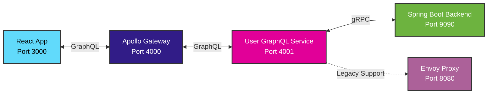

# GraphQL Federation Full-Stack Application Instructions

This document explains the architecture, components, and setup process for this GraphQL Federation full-stack application.

## Architecture Overview

This application demonstrates a modern GraphQL Federation architecture with:
- **Frontend**: React with Apollo Client for GraphQL queries
- **API Gateway**: Apollo Federation Gateway aggregating multiple GraphQL services
- **Microservices**: Individual GraphQL services that wrap gRPC backend calls
- **Backend**: Spring Boot with gRPC server (Java 24)
- **Proxy**: Envoy proxy for legacy gRPC-Web support



## Why Each Component is Needed

### 1. Spring Boot Backend (Port 9090)
**Purpose**: Serves as the gRPC server that handles business logic and data operations.

**Why gRPC for Internal Communication**:
- Type-safe communication with Protocol Buffers
- Better performance with HTTP/2 for service-to-service communication
- Automatic code generation for multiple languages
- Built-in streaming capabilities
- Strong contract definition with .proto files

**Key Files**:
- `backend/src/main/proto/user_service.proto` - Service definition
- `backend/src/main/java/org/jrg/grpc/service/UserGrpcService.java` - Service implementation
- `backend/src/main/resources/application.properties` - gRPC configuration

### 2. User GraphQL Service (Port 4001)
**Purpose**: Wraps the gRPC backend with a GraphQL API and participates in Apollo Federation.

**Why GraphQL Layer**:
- Provides a unified, client-friendly API
- Supports Apollo Federation for schema composition
- Enables flexible queries and better developer experience
- Abstracts underlying gRPC complexity from frontend

**Key Files**:
- `user-graphql-service/src/index.js` - GraphQL service server
- `user-graphql-service/src/schema.js` - GraphQL schema definition
- `user-graphql-service/src/resolvers.js` - GraphQL resolvers
- `user-graphql-service/src/grpc-client.js` - gRPC client for backend communication

### 3. Apollo Gateway (Port 4000)
**Purpose**: Aggregates multiple GraphQL services into a single federated schema.

**Why Apollo Federation**:
- Enables microservices architecture with unified GraphQL API
- Allows teams to work on separate services independently
- Provides schema composition and type merging
- Supports distributed GraphQL across multiple services

**Key Files**:
- `apollo-gateway/src/index.js` - Gateway server configuration
- `docker-compose.graphql.yml` - Full stack deployment

### 4. Envoy Proxy (Port 8080)
**Purpose**: Provides legacy gRPC-Web support for direct backend communication if needed.

**Why Envoy is Available**:
- Maintains backward compatibility with gRPC-Web clients
- Handles CORS for cross-origin requests
- Provides fallback option for direct backend access
- Supports gradual migration strategies

**Key Files**:
- `envoy.yaml` - Envoy configuration with gRPC-Web filter and CORS settings

### 5. React Frontend (Port 3000)
**Purpose**: Provides the user interface using Apollo Client for GraphQL queries.

**Why Apollo Client instead of gRPC-Web**:
- Single GraphQL endpoint for all data needs
- Automatic query optimization and caching
- Better developer experience with GraphQL tooling
- Flexible querying capabilities
- Type-safe operations with code generation

**Key Files**:
- `frontend-graphql/src/` - React components using Apollo Client
- `frontend-graphql/src/graphql/` - GraphQL queries and mutations
- `frontend-graphql/package.json` - Apollo Client dependencies

## Development Workflow

### Starting the Full Stack

#### Option 1: Docker Compose (Recommended)
```bash
# Start the entire GraphQL Federation stack
docker-compose -f docker-compose.graphql.yml up --build

# Services available at:
# - Frontend: http://localhost:3000
# - Apollo Gateway: http://localhost:4000/graphql
# - User GraphQL Service: http://localhost:4001/graphql
# - gRPC Backend: localhost:9090
# - Envoy Proxy: http://localhost:8080 (legacy support)
```

#### Option 2: Manual Development Setup
```bash
# Terminal 1: Start Backend
cd backend
./mvnw spring-boot:run

# Terminal 2: Start User GraphQL Service
cd user-graphql-service
npm install
npm start

# Terminal 3: Start Apollo Gateway
cd apollo-gateway
npm install
npm start

# Terminal 4: Start Frontend
cd frontend-graphql
npm install
npm start

# Terminal 5: Start Envoy (if needed)
docker run -p 8080:8080 -v $(pwd)/envoy.yaml:/etc/envoy/envoy.yaml envoyproxy/envoy:v1.22.0
```

### Adding New GraphQL Services

1. **Create New Service**:
   ```bash
   mkdir new-service-graphql
   cd new-service-graphql
   npm init -y
   npm install @apollo/subgraph graphql apollo-server-express
   ```

2. **Implement Federated Schema**:
   ```javascript
   // new-service-graphql/src/schema.js
   import { buildSubgraphSchema } from '@apollo/subgraph';
   import { gql } from 'apollo-server-express';
   
   const typeDefs = gql`
     extend type Query {
       newServiceOperation: String
     }
   `;
   
   const resolvers = {
     Query: {
       newServiceOperation: () => "Hello from new service"
     }
   };
   
   export const schema = buildSubgraphSchema({ typeDefs, resolvers });
   ```

3. **Update Apollo Gateway**:
   ```javascript
   // apollo-gateway/src/index.js
   const subgraphs = [
     { name: 'users', url: 'http://user-graphql-service:4001/graphql' },
     { name: 'newservice', url: 'http://new-service-graphql:4002/graphql' },
   ];
   ```

4. **Update Docker Compose**:
   ```yaml
   # docker-compose.graphql.yml
   new-service-graphql:
     build: ./new-service-graphql
     ports:
       - "4002:4002"
     environment:
       - PORT=4002
   ```

### Testing the GraphQL Federation

1. **Apollo Gateway Playground**:
   - Open http://localhost:4000/graphql
   - Use GraphQL Playground to test queries across services

2. **Individual Service Testing**:
   ```bash
   # Test user service directly
   curl -X POST http://localhost:4001/graphql \
     -H "Content-Type: application/json" \
     -d '{"query": "{ users { id name email } }"}'
   ```

3. **Frontend Integration**:
   ```bash
   # Check frontend GraphQL queries
   cd frontend-graphql
   npm run codegen  # Generate TypeScript types from GraphQL schema
   ```

## CI/CD Pipeline

The project includes a GitHub Actions workflow that:
- Builds and tests all Node.js services
- Builds and tests the Java backend
- Runs integration tests across services
- Performs security scanning
- Builds and pushes Docker images

**Key Files**:
- `.github/workflows/ci-cd.yml` - Main CI/CD pipeline
- `.github/workflows/README.md` - Pipeline documentation

## Protocol Buffer Integration

While the frontend uses GraphQL, the backend services still communicate via gRPC:

1. **Proto File Changes**:
   ```bash
   # Backend (automatic with Maven)
   cd backend
   mvn clean compile  # Regenerates Java classes
   
   # GraphQL Service
   cd user-graphql-service
   npm run proto:generate  # If using protoc directly
   ```

2. **Schema Updates**:
   - Update `.proto` files in `backend/src/main/proto/`
   - Regenerate gRPC clients in GraphQL services
   - Update GraphQL schema to match new proto definitions
   - Update resolvers to handle new fields/operations

## Monitoring and Debugging

### GraphQL Federation Debugging
```bash
# Check gateway schema composition
curl http://localhost:4000/graphql \
  -H "Content-Type: application/json" \
  -d '{"query": "{ _service { sdl } }"}'

# Check service health
curl http://localhost:4001/graphql \
  -H "Content-Type: application/json" \
  -d '{"query": "{ __typename }"}'
```

### Backend gRPC Debugging
```bash
# Test gRPC services directly
grpcurl -plaintext localhost:9090 list
grpcurl -plaintext localhost:9090 org.jrg.grpc.UserService/GetAllUsers
```

### Common Issues
- **Schema conflicts**: Ensure type names don't conflict across services
- **Service discovery**: Verify all services are reachable by Apollo Gateway
- **gRPC connectivity**: Check that GraphQL services can reach gRPC backend
- **Apollo Federation**: Ensure `@apollo/subgraph` is used correctly

## Production Considerations

1. **Schema Registry**: Use Apollo Studio for schema management
2. **Caching**: Implement Redis for Apollo Gateway caching
3. **Monitoring**: Add Apollo Studio metrics and tracing
4. **Security**: Implement authentication/authorization across services
5. **Scaling**: Use Kubernetes for service orchestration

## Benefits of This Architecture

1. **Unified API**: Single GraphQL endpoint for all client needs
2. **Microservices**: Independent service development and deployment
3. **Type Safety**: End-to-end type safety from database to UI
4. **Performance**: Efficient queries with GraphQL and fast gRPC backend
5. **Developer Experience**: Great tooling and introspection capabilities
6. **Scalability**: Easy to add new services and scale independently

## Migration from gRPC-Web

If you have existing gRPC-Web clients, you can migrate gradually:

1. **Phase 1**: Add GraphQL layer while keeping gRPC-Web support
2. **Phase 2**: Migrate frontend components to use GraphQL
3. **Phase 3**: Remove gRPC-Web dependencies once migration is complete

The Envoy proxy provides backward compatibility during the migration period.
  connect_timeout: 0.25s
  type: logical_dns
  http2_protocol_options: {}  # Enable HTTP/2 for gRPC
  load_assignment:
    cluster_name: grpc_service
    endpoints:
    - lb_endpoints:
      - endpoint:
          address:
            socket_address:
              address: 192.168.1.87  # Host machine IP (not localhost!)
              port_value: 9090
```

**Important**: The address must be the host machine's IP, not `127.0.0.1`, because Envoy runs in Docker.

### Frontend Setup

#### Package Dependencies
```json
{
  "grpc-web": "^1.5.0",
  "google-protobuf": "^3.21.2",
  "@types/google-protobuf": "^3.15.12"
}
```

#### Code Generation Script
```json
{
  "scripts": {
    "proto:generate": "protoc --js_out=import_style=commonjs:src/generated --grpc-web_out=import_style=typescript,mode=grpcwebtext:src/generated --proto_path=../backend/src/main/proto ../backend/src/main/proto/user_service.proto"
  }
}
```

#### Client Usage
```typescript
const grpcClient = new UserServiceClient('http://localhost:8080', null, null);

const loadUsers = async () => {
  const request = new GetAllUsersRequest();
  const response = await grpcClient.getAllUsers(request, {});
  // Handle response...
};
```

## Development Workflow

### 1. Protocol Buffer Changes
When you modify the `.proto` file:

1. **Backend**: Maven automatically regenerates Java classes during build
2. **Frontend**: Run `npm run proto:generate` to regenerate TypeScript clients
3. **Both**: Update service implementations and client code as needed

### 2. Development Flow
```bash
# 1. Start backend
cd backend
mvn spring-boot:run

# 2. Start Envoy (in another terminal)
docker run -it --rm -p 8080:8080 -p 9901:9901 \
  -v $(pwd)/envoy.yaml:/etc/envoy/envoy.yaml \
  envoyproxy/envoy:v1.28-latest -c /etc/envoy/envoy.yaml

# 3. Start frontend (in another terminal)
cd frontend
npm start
```

### 3. Testing the Stack
- **Frontend**: http://localhost:3000
- **Envoy Admin**: http://localhost:9901 (for debugging)
- **Backend Health**: Use grpcurl or direct gRPC client testing

## Troubleshooting Common Issues

### 1. 503 Service Unavailable
**Cause**: Envoy cannot connect to backend
**Solutions**:
- Verify backend is running on port 9090
- Check Envoy configuration has correct host IP (not 127.0.0.1)
- Use `docker logs <container-id>` to check Envoy logs

### 2. CORS Errors
**Cause**: Frontend origin not allowed
**Solution**: Update CORS configuration in `envoy.yaml`:
```yaml
cors:
  allow_origin_string_match:
  - prefix: "http://localhost:3000"  # Add your frontend URL
```

### 3. Method Not Found
**Cause**: Mismatch between proto definition and implementation
**Solutions**:
- Verify proto file is identical between backend and frontend
- Regenerate code after proto changes
- Check service method names match exactly

### 4. Connection Refused
**Cause**: Service not running or wrong port
**Solutions**:
- Verify all three services are running
- Check port conflicts with `netstat -an | grep LISTEN`
- Verify Docker networking for Envoy

## Production Considerations

### Security
- Add authentication/authorization to gRPC services
- Use TLS for gRPC communication
- Implement proper CORS policies
- Add rate limiting in Envoy

### Deployment
- Use Docker Compose for orchestration
- Configure health checks for all services
- Set up service discovery for dynamic backend addresses
- Add monitoring and logging

### Performance
- Configure connection pooling in Envoy
- Optimize protobuf message sizes
- Implement gRPC streaming for large datasets
- Add caching layers where appropriate

## Benefits of This Architecture

1. **Type Safety**: End-to-end type safety from database to UI
2. **Performance**: HTTP/2 multiplexing and binary protocol
3. **Code Generation**: Automatic client/server code generation
4. **Future-Proof**: Easy to add streaming, new services, or other language clients
5. **Developer Experience**: Strong tooling and IDE support
6. **Polyglot**: Easy to add services in other languages

## Next Steps

1. Add authentication (JWT tokens)
2. Implement streaming endpoints
3. Add database persistence
4. Set up Docker Compose for easy deployment
5. Add comprehensive error handling
6. Implement proper logging and monitoring
