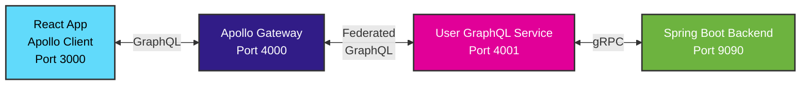

# Documentation Index

This directory contains comprehensive documentation for the GraphQL Federation stream-example project.

## 📚 Available Documentation

### 🏗️ Architecture & Setup
- **[INSTRUCTIONS.md](./INSTRUCTIONS.md)** - Complete setup and development guide
  - GraphQL Federation architecture explanation
  - Component overview and responsibilities
  - Development workflow and best practices
  - Troubleshooting and production considerations

### 🔌 API Reference
- **[GRAPHQL_API.md](./GRAPHQL_API.md)** - Complete GraphQL API documentation
  - Schema definitions and types
  - Query and mutation examples
  - Apollo Client integration guides
  - Performance and security considerations
  - Testing and monitoring approaches

### 🚀 Implementation Story
- **[ADDING_APOLLO.md](./ADDING_APOLLO.md)** - GraphQL Federation implementation
  - Migration from gRPC-Web to GraphQL Federation
  - Architecture evolution and benefits achieved
  - Current implementation status
  - Future enhancement roadmap

### 🧹 Project Evolution
- **[CLEANUP_REPORT.md](./CLEANUP_REPORT.md)** - Modernization and cleanup report
  - Infrastructure and DevOps improvements
  - File organization and dependency management
  - Technology stack evolution
  - Quality metrics and benefits achieved

## 🚀 Quick Start

Choose your approach:

### Docker Compose (Recommended)
```bash
# Start entire GraphQL Federation stack
docker-compose -f docker-compose.graphql.yml up --build

# Access services:
# - Frontend: http://localhost:3000
# - Apollo Gateway: http://localhost:4000/graphql
# - GraphQL Playground: http://localhost:4000/graphql
```

### Manual Development
```bash
# See INSTRUCTIONS.md for detailed manual setup
cd backend && mvn spring-boot:run          # Terminal 1
cd user-graphql-service && npm start          # Terminal 2  
cd apollo-gateway && npm start                # Terminal 3
cd frontend-graphql && npm start              # Terminal 4
```

## 🏗️ Architecture Overview



## 📋 Technology Stack

| Component | Technology | Purpose |
|-----------|------------|---------|
| **Frontend** | React + Apollo Client | GraphQL client with caching |
| **API Gateway** | Apollo Federation | Schema composition and routing |
| **GraphQL Service** | Express + Apollo Server | gRPC wrapper with GraphQL API |
| **Backend** | Spring Boot + gRPC | Business logic and data operations |
| **CI/CD** | GitHub Actions | Automated testing and deployment |
| **Containers** | Docker + Docker Compose | Service orchestration |

## 🔧 Development Workflow

1. **Proto Changes**: Update `.proto` files in backend
2. **Backend**: Maven automatically regenerates Java classes
3. **GraphQL Service**: Update schema and resolvers to match proto changes
4. **Gateway**: Schema composition happens automatically
5. **Frontend**: Use GraphQL queries/mutations via Apollo Client

## 📈 Key Features

- ✅ **GraphQL Federation**: Microservices with unified API
- ✅ **Type Safety**: End-to-end type safety from database to UI
- ✅ **Real-time**: GraphQL subscriptions ready
- ✅ **Performance**: Apollo Client caching and query optimization
- ✅ **DevOps**: Comprehensive CI/CD pipeline
- ✅ **Scalability**: Independent service scaling
- ✅ **Migration**: Backward compatibility with gRPC-Web

## 🐛 Troubleshooting

### Common Issues
- **Service connectivity**: Check Docker networking and ports
- **Schema conflicts**: Ensure federated services are compatible
- **gRPC errors**: Verify backend is running and accessible
- **Build failures**: Check Node.js and Java versions

### Health Checks
```bash
# Check all services
curl http://localhost:4000/graphql -d '{"query": "{ __typename }"}'
curl http://localhost:4001/graphql -d '{"query": "{ __typename }"}'
grpcurl -plaintext localhost:9090 list
```

## 📞 Support & Resources

### Internal Documentation
- Each service has its own README with specific setup instructions
- CI/CD documentation in `.github/workflows/README.md`
- Docker configuration examples in compose files

### External Resources
- [Apollo Federation Docs](https://www.apollographql.com/docs/federation/)
- [GraphQL Best Practices](https://graphql.org/learn/best-practices/)
- [Spring gRPC Integration](https://docs.spring.io/spring-boot/docs/current/reference/html/messaging.html#messaging.grpc)

## 🔮 Future Enhancements

- **Authentication**: JWT-based auth across services
- **Database**: Persistent data storage integration
- **Monitoring**: Prometheus/Grafana observability
- **Caching**: Redis caching layer
- **Additional Services**: Orders, Products, Inventory services

## 📝 Contributing

1. Read the appropriate documentation for your component
2. Follow the development workflow outlined in INSTRUCTIONS.md
3. Use the CI/CD pipeline for testing and deployment
4. Update documentation when making architectural changes

---

**Need help?** Start with [INSTRUCTIONS.md](./INSTRUCTIONS.md) for detailed setup guides.
