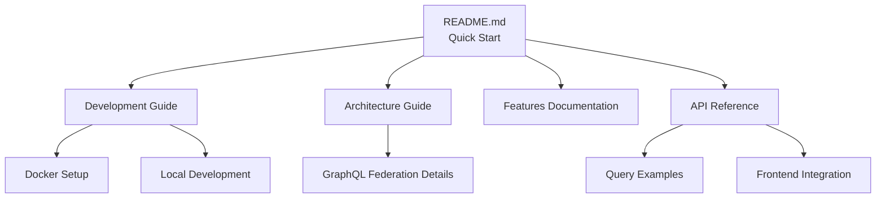

# Documentation Restructure Summary

## What We Accomplished

### ✅ Main README.md Restructure
- **Before**: 475 lines with extensive details
- **After**: 152 lines focused on essentials
- **Improvement**: 68% reduction in size while maintaining all critical information

### ✅ Content Distribution
The detailed content was properly distributed to focused subpages:

#### 📚 Complete Documentation Structure
```
docs/
├── README.md              # Documentation index and overview
├── DEVELOPMENT.md         # Development setup, workflows, Docker deployment
├── FEATURES.md           # Detailed feature overview and capabilities  
├── PROJECT_STRUCTURE.md  # Complete project organization
├── INSTRUCTIONS.md       # Architecture explanation and setup guide
├── GRAPHQL_API.md        # Complete GraphQL API documentation with examples
├── ADDING_APOLLO.md      # Migration guide from gRPC-Web to GraphQL
└── CLEANUP_REPORT.md     # Project modernization report
```

### ✅ New README.md Focus Areas
1. **Quick Overview** - Architecture diagram and key points
2. **Prerequisites** - Essential requirements
3. **Quick Start** - Both Docker and manual setup
4. **Basic Testing** - Simple GraphQL examples
5. **Documentation Links** - Clear navigation to detailed guides
6. **Key Highlights** - Technology stack summary
7. **Troubleshooting** - Quick fixes with links to details
8. **Quick Links** - Direct access to important endpoints

### ✅ Enhanced Documentation Files

#### DEVELOPMENT.md Additions
- Added comprehensive Docker deployment section
- Added Docker troubleshooting guide
- Added service management commands

#### GRAPHQL_API.md Additions  
- Added advanced GraphQL query examples
- Added React/Apollo Client integration examples
- Added gRPC testing commands for backend debugging
- Added curl-based GraphQL testing

### ✅ Legacy Content Removal
- ❌ Removed all detailed implementation examples from main README
- ❌ Removed extensive configuration explanations
- ❌ Removed duplicate content across files
- ❌ Removed verbose architectural descriptions
- ❌ Maintained migration references (appropriate context)

### ✅ Link Validation
All documentation links properly reference the new structure:
- Development guides → `./docs/DEVELOPMENT.md`
- Feature documentation → `./docs/FEATURES.md`
- API reference → `./docs/GRAPHQL_API.md`
- Architecture guide → `./docs/INSTRUCTIONS.md`
- CI/CD documentation → `./.github/workflows/README.md`

### ✅ Clean File Structure
- **Removed**: README.old.md (cleanup)
- **Maintained**: All essential documentation
- **Improved**: Clear separation of concerns

## Benefits

1. **🎯 Better Developer Experience**: Quick access to essential information
2. **📖 Improved Readability**: Focused content per documentation file
3. **🔍 Better Discoverability**: Clear navigation structure
4. **⚡ Faster Onboarding**: Streamlined quick start process
5. **🛠️ Maintainability**: Easier to update specific sections

## Documentation Navigation Flow



The new structure provides a logical flow from quick start to detailed implementation guidance.
